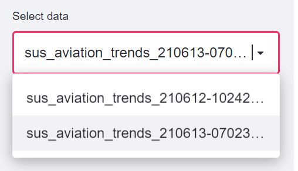
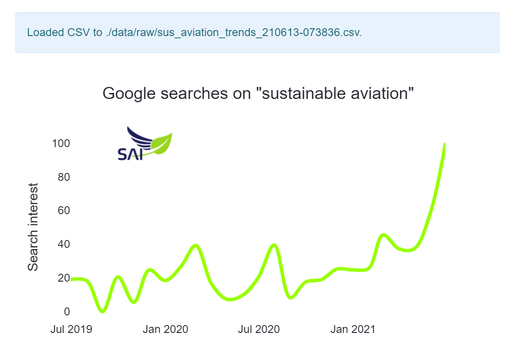

SAI visualizations
==============================

Make visuals and analyses in the CI design of SAI. 
Sustainable Aviation Initiative - Data Science task group. 

## Getting started

Open Anaconda prompt
```bash
# create conda env from file
conda env create -f conda_env.yaml
# activate
conda activate sai
# run streamlit app
streamlit run app.py
```

After opening the app for the first time, it shows an error. Do the following to resolve it:

1. Create directories: `./data/raw/` 
2. retrieve data by pushing the button: 


3. Select the data with the dropdown menu



4. Enjoy the visuals



Project Organization
------------

    ├───data
    │   ├───external
    │   ├───interim
    │   ├───processed
    │   └───raw
    ├───notebooks <-- Exploration with notebooks
    └───src <-- Source code and app directory
        ├───data <-- Helpers to retrieve data
        └───visuals <-- Helpers to visualize 

--------

<p><small>Project based on the <a target="_blank" href="https://drivendata.github.io/cookiecutter-data-science/">cookiecutter data science project template</a>. #cookiecutterdatascience</small></p>
